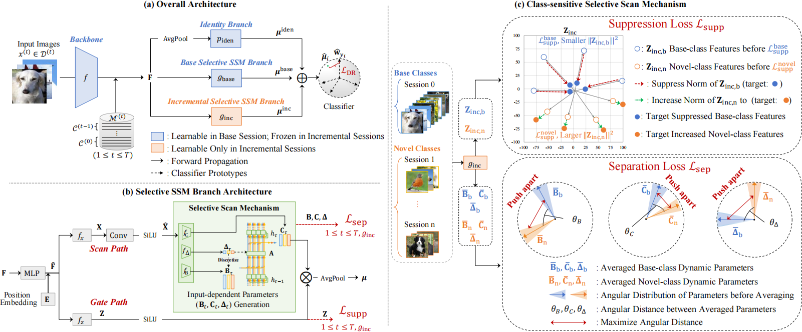

# Mamba-FSCIL: Dynamic Adaptation with Selective State Space Model for Few-Shot Class-Incremental Learning

This is the official repository for "Mamba-FSCIL: Dynamic Adaptation with Selective State Space Model for Few-Shot Class-Incremental Learning."

> **Mamba-FSCIL: Dynamic Adaptation with Selective State Space Model for Few-Shot Class-Incremental Learning**<br>
> [Xiaojie Li](https://xiaojieli0903.github.io/)^1,2, [Yibo Yang](https://yibo.yang93.github.io/)^3, [Jianlong Wu](https://wujianlong.hit.github.io)^1,2, [Yue Yu](https://yuyue.github.io/)^2, [Ming-Hsuan Yang](https://faculty.ucmerced.edu/mhyang/)^4, [Liqiang Nie](https://nieliqiang.github.io)^1, [Min Zhang](https://zhangmin2021.hit.github.io)^1<br>
> ^1Harbin Institute of Technology (Shenzhen), ^2Pengcheng Laboratory, ^3King Abdullah University of Science and Technology (KAUST), ^4University of California, Merced



## 🔨 Installation

Follow these steps to set up your environment:

- **Create and activate a new Conda environment**:
   ```shell
   conda create --name mambafscil python=3.10 -y
   conda activate mambafscil
   ```
- **Install CUDA and cuDNN**:
   Follow the [official CUDA installation instructions](https://docs.nvidia.com/cuda/cuda-installation-guide-linux/index.html).

- **Install PyTorch and torchvision**:
   - Using pip:
     ```shell
     pip install torch==1.12.1+cu113 torchvision==0.13.1+cu113 torchaudio==0.12.1 --extra-index-url https://download.pytorch.org/whl/cu113
     ```
   - Using conda:
     ```shell
     conda install pytorch==1.12.1 torchvision==0.13.1 torchaudio==0.12.1 cudatoolkit=11.3 -c pytorch
     ```

- **Install MMCV, OpenCV, and other dependencies**:
   ```bash
   pip install -U openmim
   mim install mmcv-full==1.7.0
   pip install opencv-python matplotlib einops rope timm==0.6.12 scikit-learn==1.1.3 yapf==0.40.1
   git clone https://github.com/state-spaces/mamba.git; cd mamba; git checkout v1.2.0.post1; pip install .
   ```

- **Clone the repository and set up the directory**:
   ```shell
   git clone https://github.com/xiaojieli0903/Mamba-FSCIL.git
   cd Mamba-FSCIL; mkdir ./data
   ```

## ➡️ Data Preparation

- **Download datasets** from [this link](https://huggingface.co/datasets/HarborYuan/Few-Shot-Class-Incremental-Learning/blob/main/fscil.zip) provided by NC-FSCIL.

- **Organize the datasets** in the `./data` folder:
  ```shell
  --data
    ----cifar/
    ----CUB_200_2011/
    ----miniimagenet/
  ```

## 🚀 Training
Execute the provided scripts to start training:
### CIFAR
```commandline
sh train_cifar.sh
```
| Session  | 0     | 1     | 2     | 3     | 4     | 5     | 6     | 7     | 8     |
|----------|-------|-------|-------|-------|-------|-------|-------|-------|-------|
| Mamba-FSCIL | 82.8  | 77.85 | 73.69 | 69.67	| 66.89 | 63.66	| 61.48	| 59.74	| 57.51 |

[[Base Log]](logs/cifar_base.log) [[Incremental Log]](logs/cifar_inc.log)

### Mini Imagenet
```commandline
sh train_miniimagenet.sh
```
| Session  | 0     | 1     | 2     | 3     | 4     | 5     | 6     | 7     | 8     |
|----------|-------|-------|-------|-------|-------|-------|-------|-------|-------|
| Mamba-FSCIL | 84.93| 80.02	| 74.61	| 71.33	| 69.15	| 65.62	| 62.38	| 60.93	| 59.36 |

[[Base Log]](logs/mini_base.log) [[Incremental Log]](logs/mini_inc.log)

### CUB
```commandline
sh train_cub.sh
```
| Session  | 0      | 1     | 2     | 3      | 4      | 5      | 6      | 7      | 8      | 9     | 10   |
|----------|--------|-------|-------|--------|--------|--------|--------|--------|--------|-------|-------|
| Mamba-FSCIL | 80.9   | 76.26 | 72.97 | 70.14  | 67.83  | 65.74  | 65.43  | 64.12  | 62.31  | 62.12 | 61.65 |

[[Base Log]](logs/cub_base.log) [[Incremental Log]](logs/cub_inc.log)

## ✏️ Citation
If you find our work useful in your research, please consider citing:
```bibtex
@article{li2024mamba,
  title={Mamba-FSCIL: Dynamic Adaptation with Selective State Space Model for Few-Shot Class-Incremental Learning},
  author={Li, Xiaojie and Yang, Yibo and Wu, Jianlong and Yu, Yue and Yang, Ming-Hsuan and Nie, Liqiang and Zhang, Min},
  journal={arXiv preprint arXiv:2407.06136},
  year={2024}
}
```

## 👍 Acknowledgments
This codebase builds on [FSCIL](https://github.com/NeuralCollapseApplications/FSCIL).Thank you to all the contributors.
